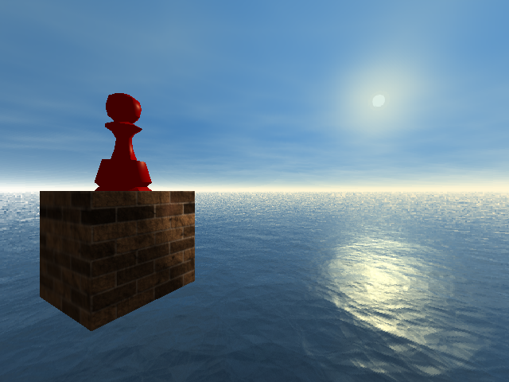

# Multithreaded Ray Tracer

This project implements a CPU-based whitted ray tracer in C++. It supports multithreaded rendering, OBJ mesh loading, multiple geometric primitives, Blinn-Phong shading, shadows, reflections, texture mapping, mipmaps, skyboxes, and interactive scene editing.

The number of row based rendering jobs can be adjusted while the program is running, making it easy to compare rendering performance at different levels of parallelism. OpenGL is used to display the framebuffer generated by the CPU ray tracer.

<p align="center">
  
  <br>
  <sub>Additional images are available in the <a href="./screenshots">screenshots</a> folder.</sub>
</p>

## Requirements

- C++17 compatible compiler
- CMake 3.22+
- OpenGL 3.3+
- GLFW 3.3+
- GLEW 2.2+

## Setup Instructions

1. Clone the repository and navigate to the project root directory.
2. Run the following commands:

   ```bash
   mkdir build
   cd build
   cmake ..
   make
   ./Main
   ```

## Features

- Multithreaded CPU rendering with adjustable row based jobs
- OBJ meshes and geometric primitives with AABB acceleration
- Shared mesh geometry with independently transformed instances
- Blinn-Phong shading with shadows and recursive reflections
- Custom mipmap generation with raycone LOD selection
- Interactive object picking, transformation, and duplication
- Cubemap skybox and procedural sky models

## Life of a Ray

For each pixel, the active camera generates a ray in world space. The ray is first tested against each mesh's AABB, allowing the renderer to skip expensive triangle intersections when the ray misses the mesh's bounds. The ray is then transformed into the mesh's local space for surface intersection testing. The closest hit point and its normals are transformed back into world space using the mesh's model and normal matrices.

If the ray misses the scene, its direction is used to sample the active sky model. If it hits a surface, the raycone is updated for texture LOD selection before Blinn-Phong lighting is calculated. Shadow rays determine whether each light is visible, and reflective materials generate recursive rays. The final color is gamma corrected, written to the CPU framebuffer, and displayed through OpenGL.

## Resources and Mesh Transformations

The resource system loads OBJ meshes, textures, and cubemaps from disk. Imported geometry is shared between mesh instances, while each instance maintains its own material, texture, AABB, and transformation.

A custom OBJ parser imports triangular meshes with optional texture coordinates and vertex normals. When vertex normals are not provided, face normals are generated from the triangle geometry.

Each mesh stores a model matrix, inverse model matrix, and normal matrix. Rays and points are converted from world space to local space for intersection testing, then hit points and normals are converted back to world space for shading. This allows meshes to be translated, rotated, and non-uniformly scaled without modifying their original vertices.

The transformation system is built on a small math library that provides vector operations, matrix multiplication, model matrix inversion, and normal matrix generation.

## Texture Sampling and Mipmaps

Textures support six combinations of nearest and linear filtering across texels and mipmap levels. A raycone estimates each ray's texture footprint and selects the appropriate level of detail.

Mipmap chains are generated on the CPU using eight configurable reconstruction filters, ranging from basic point and box filtering to higher-quality kernels such as Triangle, Catmull-Rom, and Gaussian.

## Atmosphere

The atmosphere can use either a skybox or a procedural sky. The procedural model blends sky and horizon colors from the ray direction and can render either a sun or moon aligned with the scene's directional light. When a ray misses all scene geometry, the active atmosphere provides its final color.

## Multithreading

The framebuffer is divided into an adjustable number of row based rendering jobs, which are processed by a persistent worker thread pool. The number of rendering jobs starts at the largest power of two supported by the system and can be changed while the program is running.

| Key | Action |
|-----|--------|
| <kbd>1</kbd> | Halve the rendering job count |
| <kbd>2</kbd> | Double the rendering job count |

## Mesh Selection

Mouse coordinates are converted into a ray from the active camera. The closest intersected mesh is selected, allowing one or more meshes to be transformed or duplicated together.

| Input | Action |
|-------|--------|
| Left Click | Select a mesh |
| Right Click | Deselect a mesh |
| <kbd>V</kbd> | Duplicate selected meshes |
| <kbd>B</kbd> | Toggle AABB visualization |

## Object Controls

| Key | Action |
|-----|--------|
| <kbd>I</kbd> / <kbd>K</kbd> | Move along the positive / negative Z-axis |
| <kbd>J</kbd> / <kbd>L</kbd> | Move along the negative / positive X-axis |
| <kbd>Backslash</kbd> / <kbd>Enter</kbd> | Move along the positive / negative Y-axis |
| <kbd>P</kbd> / <kbd>;</kbd> | Rotate pitch |
| <kbd>U</kbd> / <kbd>O</kbd> | Rotate yaw |
| <kbd>M</kbd> / <kbd>.</kbd> | Rotate roll |
| <kbd>3</kbd> / <kbd>4</kbd> | Scale along the X-axis |
| <kbd>5</kbd> / <kbd>6</kbd> | Scale along the Y-axis |
| <kbd>7</kbd> / <kbd>8</kbd> | Scale along the Z-axis |

## Camera Controls

| Key | Action |
|-----|--------|
| <kbd>X</kbd> | Toggle perspective and orthographic cameras |
| <kbd>W</kbd> / <kbd>S</kbd> | Move forward / backward |
| <kbd>A</kbd> / <kbd>D</kbd> | Move left / right |
| <kbd>Space</kbd> / <kbd>Left Shift</kbd> | Move up / down |
| <kbd>R</kbd> / <kbd>F</kbd> | Rotate up / down |
| <kbd>Q</kbd> / <kbd>E</kbd> | Rotate left / right |
| <kbd>Z</kbd> / <kbd>C</kbd> | Roll left / right |
| <kbd>Right Shift</kbd> | Save a screenshot |

## Scene Configuration

The scene, models, materials, lights, and textures are configured in `src/simpleTexture.cpp`. Shared rendering settings and scene constants are stored in `src/SceneConstants.hpp`.

## Currently Working On

- A Bash benchmarking script for comparing performance across scene configurations and different commits
- A new mesh structure with a shared vertex buffer and submeshes that index the shared vertex data and maintain separate materials